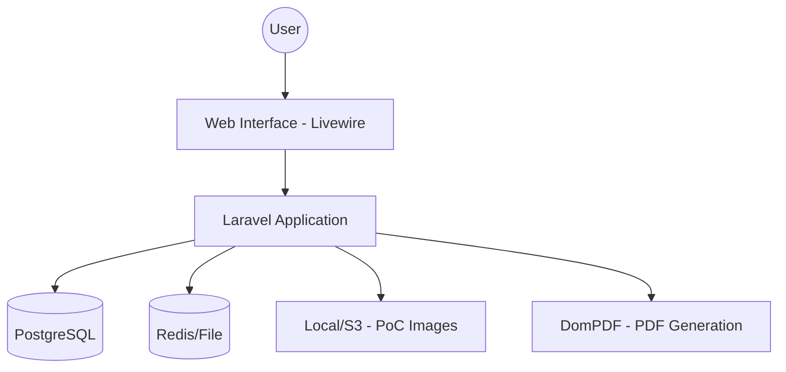

# VulnTracker 🛡️
### Cybersecurity Asset & Vulnerability Management System


---

## 🇧🇷 Sobre o Projeto
O **VulnTracker** é uma plataforma robusta e profissional desenvolvida para equipes de Red Team e Blue Team gerenciarem o ciclo de vida completo de vulnerabilidades de segurança. O sistema permite o mapeamento detalhado de ativos, reporte técnico de falhas com pontuação **CVSS**, geração de evidências (PoC) e um registro rigoroso de auditoria para fins de conformidade e transparência.

## 🇺🇸 Project Overview
**VulnTracker** is a professional-grade platform built for Red and Blue Teams to streamline the security vulnerability management lifecycle. It enables detailed asset mapping, technical flaw reporting using **CVSS** scoring, Proof of Concept (PoC) documentation, and maintains a rigorous audit trail for compliance and transparency.

---

## 🎯 Why VulnTracker?

Many organizations still manage vulnerabilities using spreadsheets and disconnected tools.

VulnTracker centralizes asset inventory, vulnerability management, audit trails and reporting into a single platform designed for security teams. It shows that you understand the business problem, not just the technology.

---

## 📸 Screenshots

### Dashboard SOC


### Vulnerability Management


### Asset Inventory


---

## 🏗️ Architecture / Arquitetura



---

## 📊 Data Model / Modelo de Dados

```
Asset
 └── Vulnerability
       └── Evidence
       └── Audit Log
```

---

## 🔄 Vulnerability Workflow

```
Open
 ↓
Triaged
 ↓
In Progress
 ↓
Mitigated
 ↓
Verified
 ↓
Closed
```

---

## 🔒 Security Features

- **CSRF Protection**: All state-changing requests are protected.
- **Authentication**: Secure access via Laravel Sanctum/Fortify.
- **Role-Based Access Control (RBAC)**: Fine-grained permissions for analysts and admins.
- **Password Hashing**: Industry-standard Bcrypt hashing.
- **Audit Logging**: Immutable records of all system activities.
- **Input Validation**: Strict validation for all user-provided data.
- **SQL Injection Protection**: Guaranteed by Laravel's Eloquent ORM.

---

## 🚀 Funcionalidades Principais / Key Features

- **🛡️ Asset Management**: Gestão completa de inventário de TI (IPs, URLs, Servidores).
- **🪲 Vulnerability Lifecycle**: Controle de estados (Aberta, Em Correção, Mitigada, Aceita).
- **📊 SOC Dashboard**: Painel analítico em tempo real com métricas de severidade e ativos comprometidos.
- **📑 PDF Reporting**: Geração de relatórios técnicos detalhados para exportação.
- **📜 Audit Trail**: Logs de auditoria imutáveis capturando todas as ações de analistas.
- **📧 Critical Alerts**: Sistema de notificações por e-mail para vulnerabilidades de alta criticidade.
- **⚖️ CVSS Scoring**: Cálculo integrado de severidade baseado no padrão da indústria.

---

## 🚧 Roadmap

- [x] Asset Inventory
- [x] CVSS Scoring
- [x] PDF Reports
- [ ] CVE Integration
- [ ] NVD API Synchronization
- [ ] Multi-Tenant Support
- [ ] SSO Authentication

---

## 🛠️ Stack Tecnológica / Tech Stack

- **Backend**: PHP 8.3+ | Laravel 13 (Blade & Volt)
- **Frontend**: Livewire 3 (Reactive components) | Tailwind CSS
- **Database**: PostgreSQL 16
- **Infrastructure**: Docker & Docker Compose
- **Testing**: Pest PHP
- **Utilities**: Mailpit (E-mail testing) | DomPDF (PDF generation)

---

## ⚙️ Instalação / Installation

### Pré-requisitos
- Docker & Docker Compose
- Git

### Passo a Passo

1. **Clone o repositório:**
   ```bash
   git clone https://github.com/leowalker/vulntracker.git
   cd vulntracker
   ```

2. **Configuração de Ambiente:**
   ```bash
   cp .env.example .env
   ```

3. **Suba os containers (Docker):**
   ```bash
   docker compose up -d
   ```

4. **Instale as dependências e prepare o banco:**
   ```bash
   # Entre no container da aplicação
   docker exec -it pgv_app bash

   # Dentro do container:
   composer install
   php artisan key:generate
   php artisan migrate --seed
   ```

5. **Compile os assets (Frontend):**
   ```bash
   # Caso não tenha o Node local, use o container:
   docker exec -it pgv_node npm install
   docker exec -it pgv_node npm run build
   ```

6. **Acesse a aplicação:**
   - **App**: `http://localhost:8000`
   - **Mailpit (E-emails)**: `http://localhost:8025`

---

## 🧪 Testes / Testing

O projeto utiliza **Pest PHP** para garantir a estabilidade e segurança das funcionalidades principais.

```bash
docker exec -it pgv_app php artisan test
```

---

## 📁 Estrutura do Projeto / Project Structure (Highlights)
- `app/Models`: Definição de Ativos, Vulnerabilidades e Auditoria.
- `app/Livewire`: Componentes interativos do dashboard e gerenciadores.
- `app/Observers`: Gatilhos automáticos para logs de auditoria.
- `resources/views/reports`: Templates para exportação de PDFs.

---

## 👨‍💻 Author

**Léo Walker da Silva**
Computer Science Student at UNEMAT

[](https://github.com/leowalker)
[](https://linkedin.com/in/leowalker)

---

## 📄 Licença / License
Distribuído sob a licença MIT. Veja `LICENSE` para mais informações.
